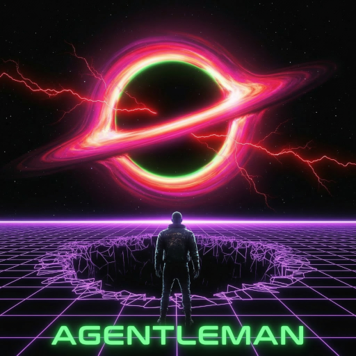
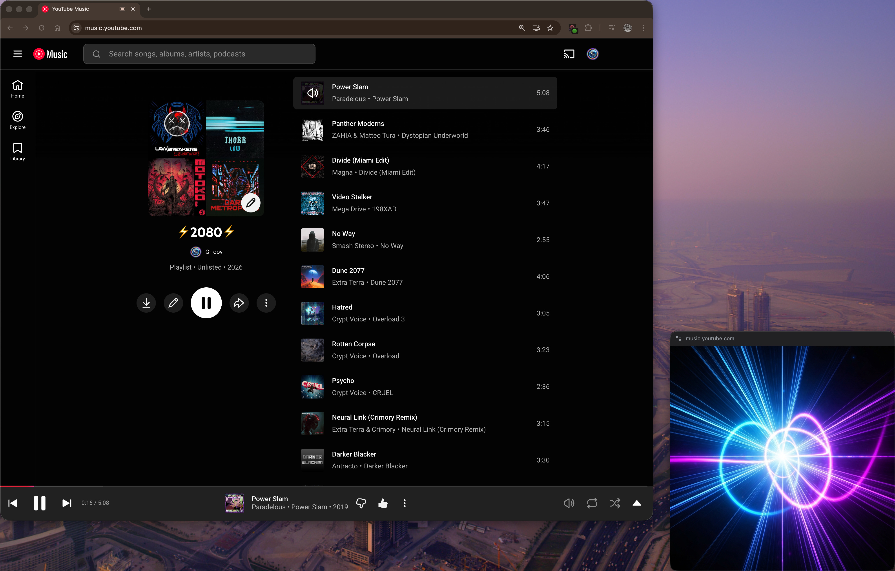
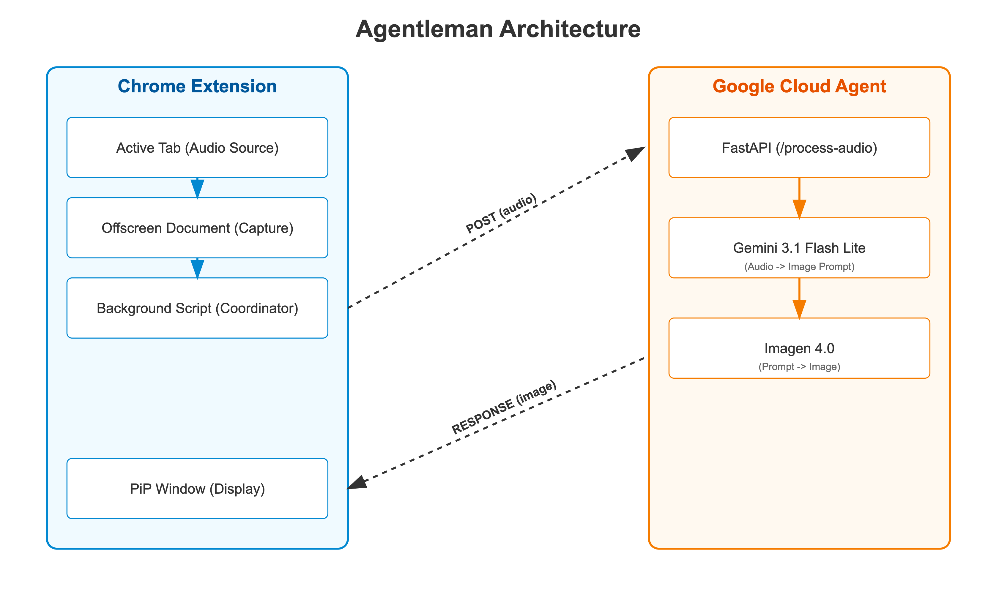

# Agentleman
<div align="left">
  
</div>

## See Your Sound!
See the soul of your audio! Our Chrome extension uses Gemini Cloud AI to instantly turn the music, news, or videos in your browser into stunning, evolving visual art within a floating window.
<div align="left">
  
</div>


## How it works
Agentleman has two components:  
- A cloud agent that lives in Google Cloud Run where:  
  - It receives uploaded audio snippets at a REST endpoint.
  - Gemini listens to the audio, figures out what is going on, and generates a prompt for...
  - Imagen to generate artwork from the supplied prompt and send it back to the chrome extension.
- A Chrome extension that:
  - Captures small chunks of audio data and sends them to the cloud agent.
  - Receives AI generated artwork in response and displays them to the user.
## Architectural Diagram
  <div align="left">
  
</div>

## ADK Audio-to-Image Agent

The Agent Development Kit (ADK) project exposes a web service endpoint designed to run on Google Cloud Run. It listens for 1-minute chunks of audio data and passes them to the `gemini-3.1-flash-lite-preview` model, instructing Gemini to generate a fun and playful image that corresponds to the audio.

### Prerequisites

- Docker
- Google Cloud CLI (`gcloud`)
- A Google Cloud Project with the Vertex AI / Gemini API enabled
- `GOOGLE_API_KEY` (Gemini API key)

### Local Development

1. **Install dependencies:**
   ```bash
   pip install -r requirements.txt
   ```

2. **Run the server:**
   ```bash
   export GOOGLE_API_KEY="your-api-key"
   python main.py
   ```
   Or use uvicorn directly:
   ```bash
   uvicorn main:app --reload
   ```

3. **Test the endpoint:**
   Send a POST request with an audio file to the `/process-audio` endpoint.
   ```bash
   curl -X POST -F "audio=@path_to_your_audio.wav" http://localhost:8080/process-audio -o output_image.png
   ```

### Deployment to Google Cloud Run

**Note:** Ensure `YOUR_PROJECT_ID` is your alphanumeric Project ID (e.g., `my-cool-project-123`), not the numeric Project Number.

1. **Build the container image:**
   ```bash
   gcloud builds submit . --tag gcr.io/YOUR_PROJECT_ID/adk-audio-agent --project YOUR_PROJECT_ID
   ```

2. **Deploy to Cloud Run:**
   ```bash
   gcloud run deploy adk-audio-agent \
     --image gcr.io/YOUR_PROJECT_ID/adk-audio-agent \
     --platform managed \
     --region us-central1 \
     --allow-unauthenticated \
     --set-env-vars GOOGLE_API_KEY="your-api-key" \
     --project YOUR_PROJECT_ID
   ```

### Endpoints

- `POST /process-audio`: Expects an uploaded audio file (up to 1 minute recommended) and returns a generated image.
- `GET /health`: Health check endpoint.

## Chrome Extension

The Chrome Extension silently monitors and records audio from your active tab once the user clicks the extension icon to begin listening. While in its active "listening" state, the extension buffers the audio using the efficient Opus codec and periodically dispatches it to a remote web service. The web service analyzes the audio, generates a contextual AI image based on the content, and returns it to the extension.

The extension displays a persistent, frameless Picture-in-Picture (PiP) window featuring a smooth, animated progress bar to indicate buffer fill status. When a new image is returned from the AI endpoint, it elegantly crossfades over the previous image inside the PiP window.

### Features
- **Tab Audio Capture:** Leverages Chrome's `tabCapture` API via a background Offscreen Document to record audio without obtrusive system dialogs.
- **Dynamic Picture-in-Picture:** Utilizes the modern Document Picture-in-Picture API (with a legacy Canvas fallback) to maintain an always-on-top, dynamically updating visual display.
- **Adaptive Buffer Timing:** Initially captures 15 seconds of audio to provide a rapid first visual response, before settling into a consistent 60-second polling interval.
- **Opus Encoding:** Compresses audio natively in the browser to 128kbps WebM/Opus, minimizing bandwidth usage while maintaining quality.
- **Smooth Animations:** Includes sub-second progress bar tracking and seamless 3-second CSS crossfades between AI generated images.

### Installation Instructions (Developer Mode)

Since this is an unpacked developer extension, you will need to manually load it into Google Chrome.

1. **Clone or Download the Repository**
   Ensure you have the entire `agentleman` directory downloaded to your local machine.

2. **Open Chrome Extensions Page**
   Open Google Chrome and navigate to the Extensions management page. You can do this by typing the following URL into your address bar and pressing Enter:
   `chrome://extensions/`

3. **Enable Developer Mode**
   In the top right corner of the Extensions page, you will see a toggle switch labeled **"Developer mode"**. Click it to turn it on.

4. **Load the Unpacked Extension**
   - After enabling Developer Mode, three new buttons will appear in the top left of the screen.
   - Click the button labeled **"Load unpacked"**.
   - A file browser dialog will appear. Navigate to and select the `agentleman` folder on your computer (the folder that contains `manifest.json`).
   - Click "Select" or "Open".

5. **Pin the Extension (Optional but Recommended)**
   - To make the extension easy to use, click the "Puzzle piece" icon (Extensions) in the top right of your Chrome toolbar.
   - Find **Agentleman** in the list and click the "Pin" icon next to it so it remains permanently visible in your toolbar.

### Usage

1. Navigate to any tab that is playing audio (e.g., a YouTube video, a podcast, or a web meeting).
2. Click the **Agentleman** extension icon in your toolbar.
3. The icon badge will display a green circle (🟢) indicating it is actively "listening".
4. A Picture-in-Picture window will spawn showing the default placeholder image. A subtle progress bar will begin tracking across the top edge.
5. After 15 seconds, the progress bar will complete, the buffer will be dispatched to the AI endpoint, and the first generated image will fade into the PiP window.
6. The extension will then continue to record and update the image every 60 seconds.
7. To stop recording, simply click the extension icon again or manually close the Picture-in-Picture window.
